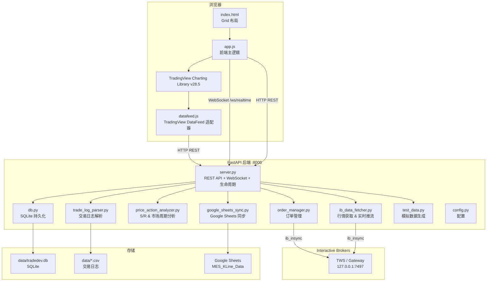
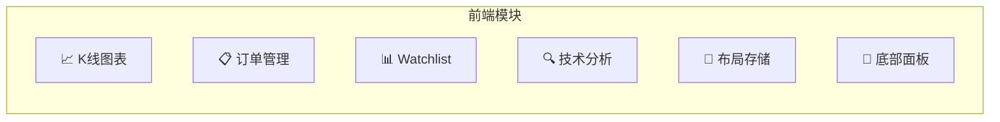
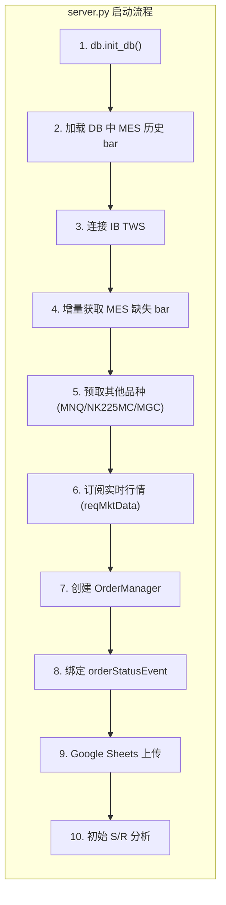
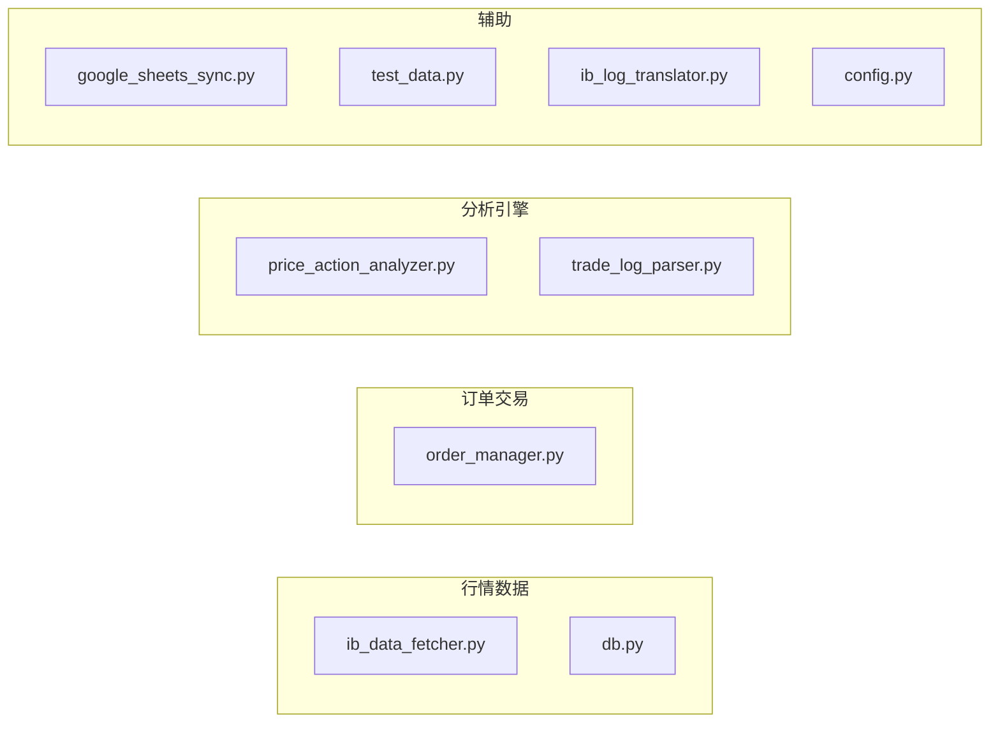
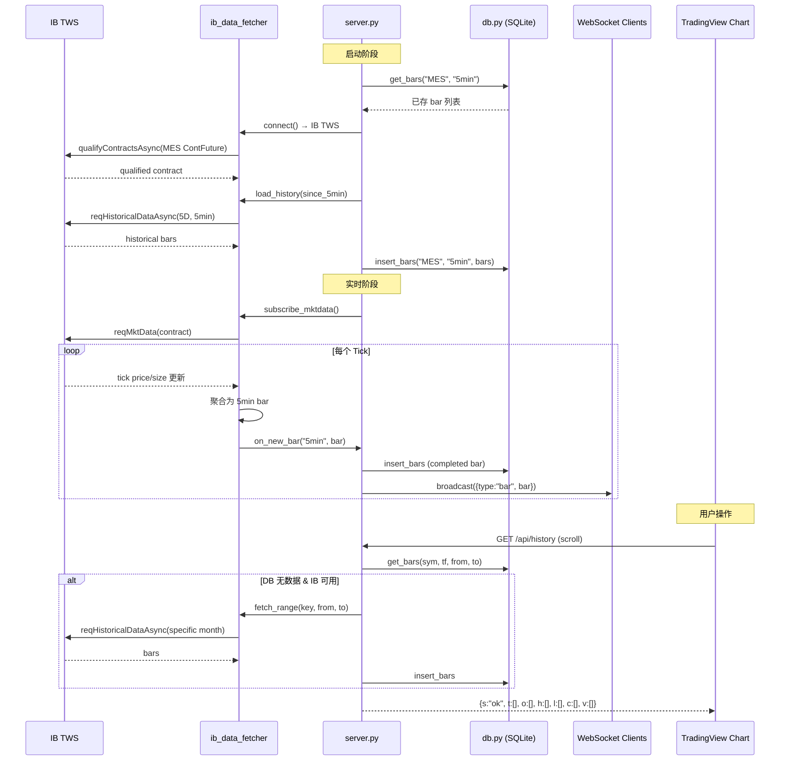
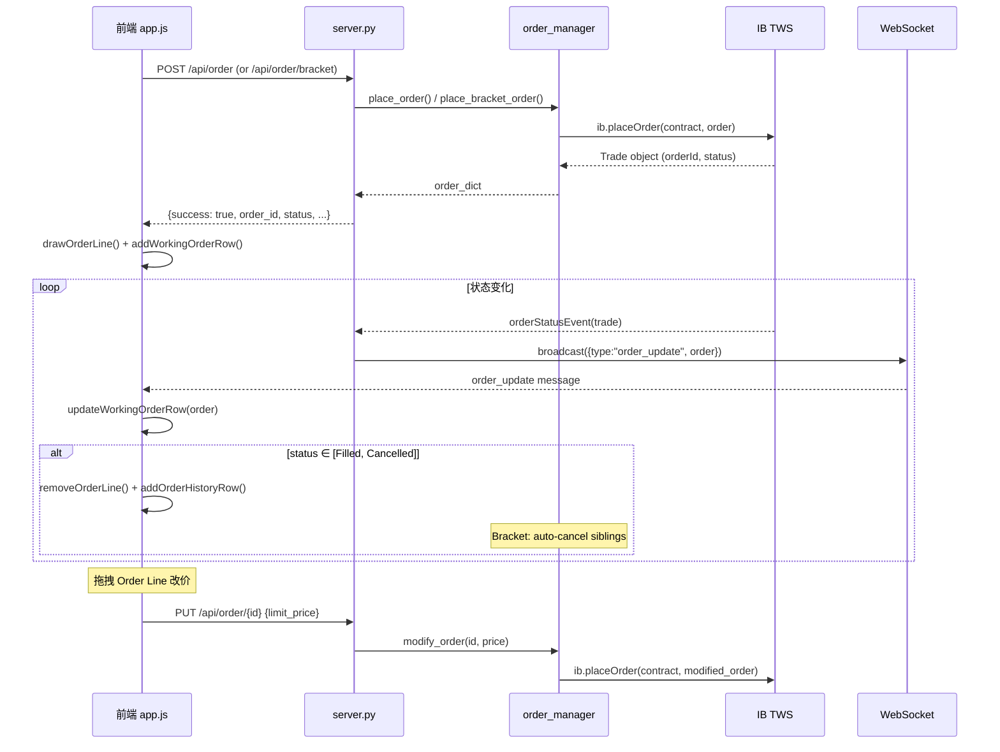
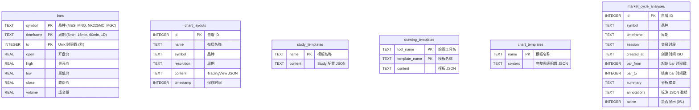

# PriceAction Trading Terminal

基于 TradingView Charting Library + FastAPI + Interactive Brokers 的实时期货交易终端。

---

## 系统总架构



---

## 一、前端功能模块

前端由三个文件组成：`index.html`（布局 + CSS）、`app.js`（交互逻辑）、`datafeed.js`（TradingView 数据适配）。



### 1.1 K线图表模块

| 功能 | 函数 / 组件 | 调用接口 |
|------|------------|---------|
| 初始化图表 | `initChart()` | — |
| 品种 K 线获取 | `MESDatafeed.getBars()` | `GET /api/history?symbol=&resolution=&from=&to=` |
| 品种元数据获取 | `MESDatafeed.resolveSymbol()` | `GET /api/symbols?symbol=` |
| 服务端配置 | `MESDatafeed.onReady()` | `GET /api/config` |
| 服务器时间同步 | `MESDatafeed.getServerTime()` | `GET /api/time` |
| 实时 K 线推送 | `MESDatafeed.subscribeBars()` | `WebSocket /ws/realtime` (`type: bar`) |
| RTH / ETH 切换 | `toggleRTH()` | 通过 `resolveSymbol` 切换 session |
| Topbar OHLC 更新 | `updateTopbarOHLC(bar)` | WebSocket 实时推送 |
| Bid/Ask 显示 | `updateBidAsk(price)` | 基于最新价 ± tick |
| 自定义指标 S-Bar Count | widget `custom_indicators_getter` | — |

### 1.2 订单管理模块

| 功能 | 函数 / 组件 | 调用接口 |
|------|------------|---------|
| 下单（Market/Limit/Stop/StopLimit） | `placeOrder()` | `POST /api/order` |
| Bracket 下单 (Entry + TP + SL) | `placeOrder()` (bracket mode) | `POST /api/order/bracket` |
| 取消单个订单 | `cancelOrder(orderId)` | `DELETE /api/order/{id}` |
| 取消全部订单 | `cancelAllOrders()` | `DELETE /api/orders` |
| 修改订单价格 (拖拽 Order Line) | `modifyOrderPrice()` | `PUT /api/order/{id}` |
| 一键平仓 | `flattenPosition()` | `POST /api/flatten` |
| 获取当前挂单 | `loadWorkingOrders()` | `GET /api/orders` |
| 获取历史订单 | `loadOrderHistory()` | `GET /api/orders?all=true` |
| 订单状态实时推送 | `handlePriceMessage()` | `WebSocket` (`type: order_update`) |
| 图表 Order Line 可视化 | `drawOrderLine()` / `removeOrderLine()` | — |
| 右键快捷下单菜单 | `_buildContextMenuItems()` | — |
| Bracket 配置 (TP/SL ticks) | `initBracketConfig()` | localStorage 持久化 |

### 1.3 Watchlist 品种栏

| 功能 | 函数 / 组件 | 调用接口 |
|------|------------|---------|
| 切换品种 | `initWatchlistClick()` | `resolveSymbol` → `setSymbol()` |
| 各品种实时价格 | `fetchWatchlistPrices()` (60s 轮询) | `GET /api/watchlist_prices` |
| MES 实时价格 | `updateWatchlistMES(price)` | WebSocket 推送 |
| 交易所 / 合约信息显示 | `fetchWatchlistContractInfo()` | `GET /api/symbols?symbol=` |

**支持品种**：

| 显示名 | IB 合约 | 交易所 | 币种 | RTH 时段 |
|--------|--------|--------|------|---------|
| MES | MES (ContFuture) | CME | USD | 09:30–16:00 ET |
| MNQ | MNQ (ContFuture) | CME | USD | 09:30–16:00 ET |
| NK225MC | N225MC (ContFuture) | OSE.JPN | JPY | 08:45–15:45 JST |
| MGC | MGC (ContFuture) | COMEX | USD | 09:30–17:00 ET |

### 1.4 技术分析模块

| 功能 | 函数 / 组件 | 调用接口 |
|------|------------|---------|
| S/R 水平线绘制 | `updateAnnotations()` / `drawHLine()` | `GET /api/analysis?symbol=` |
| Support / Resistance 显隐切换 | `toggleSR(type)` | — |
| 市场周期背景色块 | `updateAnnotations()` (cycle_ranges) | WebSocket `type: analysis` |
| 市场周期 Badge 显示 | `updateCycleBadge(cycle)` | — |
| S/R 面板数据列表 | `updateSRPanel(analysis)` | — |
| S/R Legend 拖拽 | `initSRLegendDrag()` | localStorage 位置持久化 |
| Trade 标记 (进出场箭头) | `initTradeMarkers()` / `drawTradeMarkers()` | `GET /api/trades` |

### 1.5 布局保存 / 加载

| 功能 | 函数 / 组件 | 调用接口 |
|------|------------|---------|
| 保存图表布局 | `save_load_adapter.saveChart()` | `POST /api/charts` |
| 加载图表布局 | `save_load_adapter.getChartContent()` | `GET /api/charts/{id}` |
| 列出所有布局 | `save_load_adapter.getAllCharts()` | `GET /api/charts` |
| 删除布局 | `save_load_adapter.removeChart()` | `DELETE /api/charts/{id}` |
| Study 模板 CRUD | `save_load_adapter.*StudyTemplate*()` | `GET/POST/DELETE /api/study_templates` |
| Drawing 模板 CRUD | `save_load_adapter.*DrawingTemplate*()` | `GET/POST/DELETE /api/drawing_templates` |
| Chart 模板 CRUD | `save_load_adapter.*ChartTemplate*()` | `GET/POST/DELETE /api/chart_templates` |
| 启动加载上次布局 | `load_last_chart: true` | 自动调用 `getAllCharts` + `getChartContent` |

### 1.6 底部面板

| Tab | 内容 | 更新方式 |
|-----|------|---------|
| Positions | 当前持仓 (品种/方向/数量/均价/P&L) | 5s 轮询 `GET /api/position` |
| Working Orders | 活跃挂单列表，可取消 | WebSocket `order_update` |
| Filled Orders | 已成交订单 | WebSocket `order_update` (status=Filled) |
| Order History | 全部订单历史 | 启动加载 `GET /api/orders?all=true` |
| Trade History | 历史交易日志 (CSV 来源) | 启动加载 `GET /api/trades` |
| Analysis Log | 市场周期分析记录，支持显隐切换与删除 | `GET /api/skill/analyses` + WebSocket 实时推送 |

### 1.7 市场周期分析模块 (Market Cycle Analysis)

基于 Al Brooks 价格行为方法论的 LLM 辅助市场周期分析系统。通过 Skill API 供 LLM Agent 读取 K 线数据、执行分析，并将标注结果回写到图表上。

| 功能 | 函数 / 组件 | 调用接口 |
|------|------------|--------|
| 加载分析记录 | `loadCycleAnalyses()` | `GET /api/skill/analyses` |
| 绘制图表标注 (rectangle/hline/label) | `drawOneAnalysis()` / `drawAllActiveAnalyses()` | — |
| 移除图表标注 | `removeOneAnalysis()` | — |
| 显隐切换分析 | `toggleAnalysisActive(id)` | `PUT /api/skill/analyses/{id}/active` |
| 删除分析记录 | `deleteAnalysis(id)` | `DELETE /api/skill/analyses/{id}` |
| 分析列表渲染 | `renderAnalysisTable()` | — |
| WebSocket 实时同步 | `handleCycleAnalysisWS(msg)` | WebSocket `cycle_analysis*` |

**标注类型**：

| 类型 | 图表元素 | 用途 |
|------|---------|------|
| `range` | 矩形区域 (rectangle) | 标记市场阶段 (TR, BO, Channel 等) |
| `hline` | 水平线 | 标记关键价格 (S/R, MM 目标) |
| `label` | 文字标签 | 标记特定事件或注释 |

**颜色体系** (Al Brooks PA 术语映射)：

| 标签 | 颜色 |
|------|------|
| Opening Range | 蓝色 |
| Bear Leg / Bear Breakout | 红色 |
| Bull Leg / Bull Breakout | 绿色 |
| Reversal / Double Bottom/Top | 橙色 |
| Trading Range / TTR | 灰色 |
| Channel | 紫色 |
| Measured Move | 青色 |
| Climax | 深红 |

---

## 二、前后端接口一览

### 2.1 TradingView DataFeed 接口

| 方法 | 路径 | 说明 |
|------|------|------|
| GET | `/api/config` | DataFeed 配置 (支持的 resolution、exchange 等) |
| GET | `/api/symbols?symbol=MES` | 品种元数据 (pricescale, session, timezone, ib_symbol) |
| GET | `/api/history?symbol=MES&resolution=5&from=&to=` | OHLCV K 线数据 |
| GET | `/api/time` | 服务器 Unix 时间戳 |

### 2.2 订单接口

| 方法 | 路径 | 说明 |
|------|------|------|
| POST | `/api/order` | 下单 (market/limit/stop/stop_limit) |
| POST | `/api/order/bracket` | Bracket 下单 (entry + TP + SL, OCA) |
| PUT | `/api/order/{id}` | 修改订单价格 |
| DELETE | `/api/order/{id}` | 取消单个订单 |
| DELETE | `/api/orders` | 取消全部挂单 |
| GET | `/api/orders?all=false` | 获取挂单 (all=true 含历史) |
| POST | `/api/flatten` | 一键平仓 |
| GET | `/api/position` | 当前持仓查询 |

### 2.3 分析 & 数据接口

| 方法 | 路径 | 说明 |
|------|------|------|
| GET | `/api/analysis?symbol=MES` | S/R 分析 + 市场周期 |
| GET | `/api/watchlist_prices` | 全品种最新价格 & 涨跌幅 |
| GET | `/api/trades` | 历史交易日志 (CSV 解析) |

### 2.4 布局存储接口

| 方法 | 路径 | 说明 |
|------|------|------|
| GET | `/api/charts` | 列出所有图表布局 |
| POST | `/api/charts` | 保存/更新图表布局 |
| GET | `/api/charts/{id}` | 获取图表布局内容 |
| DELETE | `/api/charts/{id}` | 删除图表布局 |
| GET/POST/DELETE | `/api/study_templates[/{name}]` | Study 模板 CRUD |
| GET/POST/DELETE | `/api/drawing_templates/{tool}[/{name}]` | Drawing 模板 CRUD |
| GET/POST/DELETE | `/api/chart_templates[/{name}]` | Chart 模板 CRUD |

### 2.5 Skill API (LLM Agent 接口)

| 方法 | 路径 | 说明 |
|------|------|------|
| GET | `/api/skill/bars?symbol=MES&timeframe=5min&limit=200` | 读取 RTH K 线数据 (09:30–16:00 ET) |
| POST | `/api/skill/analysis` | 保存分析结果 + 标注 (WebSocket 广播) |
| GET | `/api/skill/analyses?symbol=&timeframe=&active_only=false` | 查询分析记录列表 |
| PUT | `/api/skill/analyses/{id}/active?active=true` | 切换分析显隐 |
| DELETE | `/api/skill/analyses/{id}` | 删除分析记录 |

### 2.6 WebSocket

| 端点 | 方向 | type | 说明 |
|------|------|------|------|
| `/ws/realtime` | S→C | `snapshot` | 连接后推送最近 200 根 5min bar + 最新分析 |
| | S→C | `bar` | 实时 5min bar 更新 (每个 tick 聚合) |
| | S→C | `analysis` | S/R 分析更新 (新 bar 开盘时) |
| | S→C | `order_update` | 订单状态变更 |
| | S→C | `cycle_analysis` | 新分析回写 (含 annotations) |
| | S→C | `cycle_analysis_toggle` | 分析显隐切换 |
| | S→C | `cycle_analysis_delete` | 分析删除 |

---

## 三、后端代码结构



### 3.1 模块职责



| 模块 | 文件 | 职责 |
|------|------|------|
| **HTTP/WS 服务** | `server.py` | FastAPI 路由、WebSocket 推流、生命周期管理 |
| **行情获取** | `ib_data_fetcher.py` | IB 历史数据下载、实时 tick→bar 聚合、合约滚动 |
| **数据持久化** | `db.py` | SQLite CRUD (K 线、图表布局、模板) |
| **订单管理** | `order_manager.py` | 单腿/Bracket 下单、改单、撤单、持仓查询 |
| **技术分析** | `price_action_analyzer.py` | Swing Point → S/R Level 聚类、Wyckoff 市场周期检测 |
| **交易日志** | `trade_log_parser.py` | 解析 Topstep / IB CSV 交易记录 |
| **Sheets 同步** | `google_sheets_sync.py` | 实时 bar 写入 Google Sheets |
| **模拟数据** | `test_data.py` | GBM 模型 + 日内波动率曲线 + 市场周期生成 |
| **日志翻译** | `ib_log_translator.py` | IB 中文 Unicode 日志解码 |
| **配置** | `config.py` | IB 连接、合约、分析参数、品种列表 |

### 3.2 行情数据流



### 3.3 订单流程



### 3.4 与 IB 交互汇总

| 功能域 | ib_insync 调用 | 模块 |
|--------|---------------|------|
| **连接** | `IB.connectAsync(host, port, clientId)` | ib_data_fetcher |
| **合约解析** | `qualifyContractsAsync(ContFuture/Future)` | ib_data_fetcher, server |
| **历史数据** | `reqHistoricalDataAsync(contract, duration, barSize)` | ib_data_fetcher, server |
| **实时行情 (tick)** | `reqMktData(contract)` + `ticker.updateEvent` | ib_data_fetcher |
| **实时行情 (5s bar)** | `reqRealTimeBars(contract)` | ib_data_fetcher |
| **下单** | `placeOrder(contract, order)` | order_manager |
| **撤单** | `cancelOrder(order)` | order_manager |
| **持仓查询** | `positions()` | order_manager |
| **挂单查询** | `openTrades()` | order_manager |
| **订单状态事件** | `orderStatusEvent` (callback) | server |

---

## 四、数据库模型

数据库文件：`data/tradedev.db` (SQLite, WAL 模式)



### 数据分类

| 分类 | 表 | 说明 | 数据来源 |
|------|------|------|---------|
| **K 线数据** | `bars` | 多品种多周期 OHLCV | IB TWS 历史 + 实时聚合 |
| **图表布局** | `chart_layouts` | 用户保存的完整图表状态 | TradingView save_load_adapter |
| **指标模板** | `study_templates` | 可复用的指标组合 | TradingView save_load_adapter |
| **画线模板** | `drawing_templates` | 画线工具预设 | TradingView save_load_adapter |
| **图表模板** | `chart_templates` | 完整图表样式预设 | TradingView save_load_adapter |
| **市场周期分析** | `market_cycle_analyses` | LLM 分析结果 + 图表标注 | Skill API (LLM Agent) |

---

## 快速启动

```bash
# 1. 安装依赖
pip install -r requirements.txt

# 2. 确保 IB TWS 在 127.0.0.1:7497 运行 (Paper Trading)

# 3. 启动服务
cd priceaction
python3 -m uvicorn server:app --host 0.0.0.0 --port 8000 --loop asyncio

# 4. 打开浏览器
open http://localhost:8000
```

## 技术栈

| 层 | 技术 |
|----|------|
| 前端图表 | TradingView Charting Library v28.5 |
| 前端框架 | Vanilla JS + CSS Grid |
| 后端框架 | FastAPI (Python 3.10+) |
| IB 连接 | ib_insync |
| 数据库 | SQLite (WAL mode) |
| 实时通信 | WebSocket |
| 外部同步 | Google Sheets API |
