# TradeDev 数据流文档 (Data Flow Documentation)

> 本文档描述 TradeDev 系统中数据从 IB TWS 到前端 chart 的完整流转过程。
> 所有 diagram 使用 Mermaid 格式。

---

## 目录

1. [概览 (Overview)](#1-概览-overview)
2. [启动流程 (Startup)](#2-启动流程-startup)
3. [数据加载与服务 (Data Loading & Serving)](#3-数据加载与服务-data-loading--serving)
4. [IB 数据拉取触发条件 (IB Fetch Triggers)](#4-ib-数据拉取触发条件-ib-fetch-triggers)
5. [实时数据流 (Real-time Data Flow)](#5-实时数据流-real-time-data-flow)
6. [DB 与 IB 数据协作 (DB + IB Collaboration)](#6-db-与-ib-数据协作-db--ib-collaboration)
7. [数据校验流程 (Data Validation)](#7-数据校验流程-data-validation)
8. [前端数据获取 (Frontend Data Flow)](#8-前端数据获取-frontend-data-flow)

---

## 1. 概览 (Overview)

系统由四个核心层组成：**数据源层** (IB TWS)、**服务层** (FastAPI server)、**存储层** (SQLite) 和 **展示层** (TradingView chart)。数据通过 IB API 获取后存入 SQLite，由 server 统一对前端提供 REST + WebSocket 服务。

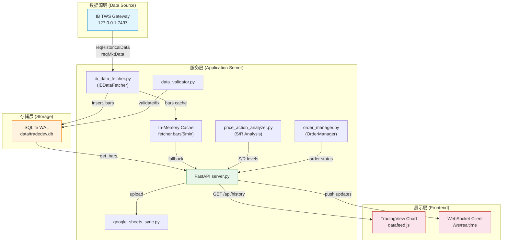

---

## 2. 启动流程 (Startup)

### 启动的时候默认如何加载数据？

Server 启动时通过 `lifespan` context manager 执行以下步骤。数据加载分为 **同步阶段**（阻塞式，server 启动前完成）和 **异步阶段**（后台任务，server 已开始接受请求）。

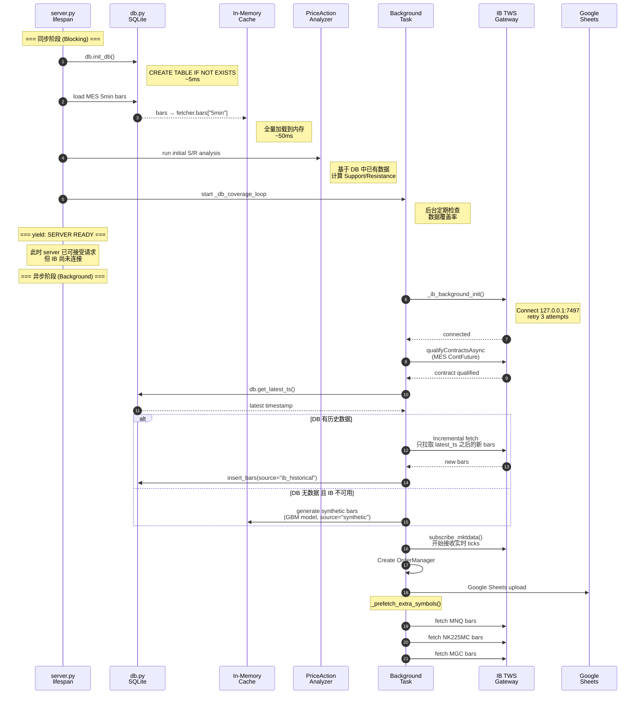

### 关键设计决策

| 阶段 | 耗时 | 说明 |
|------|------|------|
| `db.init_db()` | ~5ms | 建表（如不存在） |
| Load DB → Memory | ~50ms | MES 5min bars 全量加载 |
| S/R Analysis | ~100ms | 基于已有数据初始分析 |
| **Server Ready** | **~200ms** | **yield 后开始接受请求** |
| IB Connect | 1-10s | 后台异步，含 retry |
| Incremental Fetch | 2-30s | 仅拉新数据，非全量 |
| Extra Symbols | 5-60s | MNQ, NK225MC, MGC |

---

## 3. 数据加载与服务 (Data Loading & Serving)

### 运行过程中 DB 存储的数据是如何和 IB fetch 组合对前端提供服务？

当前端请求 `GET /api/history?symbol=MES&resolution=5&from=T1&to=T2` 时，server 执行以下流程：

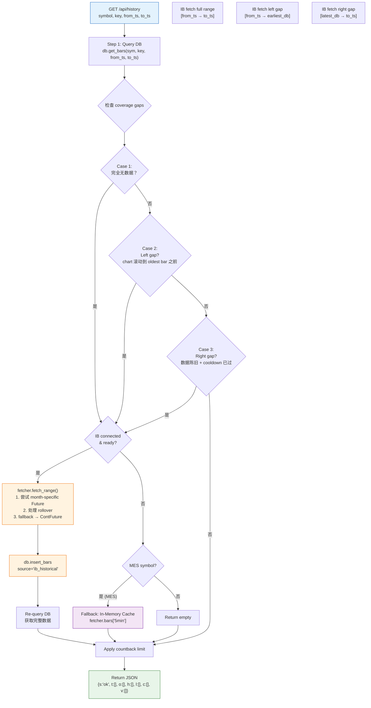

### Gap 检测逻辑详解

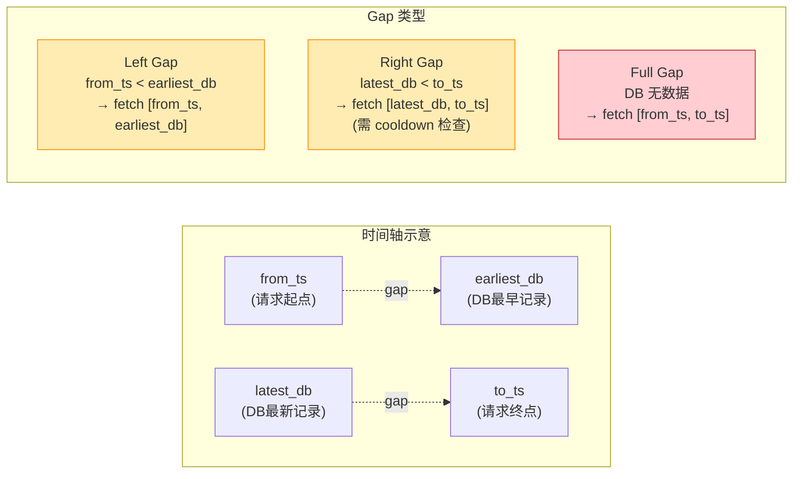

---

## 4. IB 数据拉取触发条件 (IB Fetch Triggers)

### 什么时候会触发 IB fetch？

| # | 触发场景 | 触发位置 | 拉取范围 | 备注 |
|---|---------|---------|---------|------|
| 1 | **Startup** | `_ib_background_init()` | `latest_ts → now` | Incremental，仅拉新 bars |
| 2 | **Startup Prefetch** | `_prefetch_extra_symbols()` | 完整历史 | MNQ, NK225MC, MGC |
| 3 | **On-demand** | `GET /api/history` gap 检测 | `gap_start → gap_end` | 按需拉取缺失区间 |
| 4 | **Validation** | `data_validator.py` | chunk-based | 校验时独立获取 IB 数据 |

### Cooldown 机制

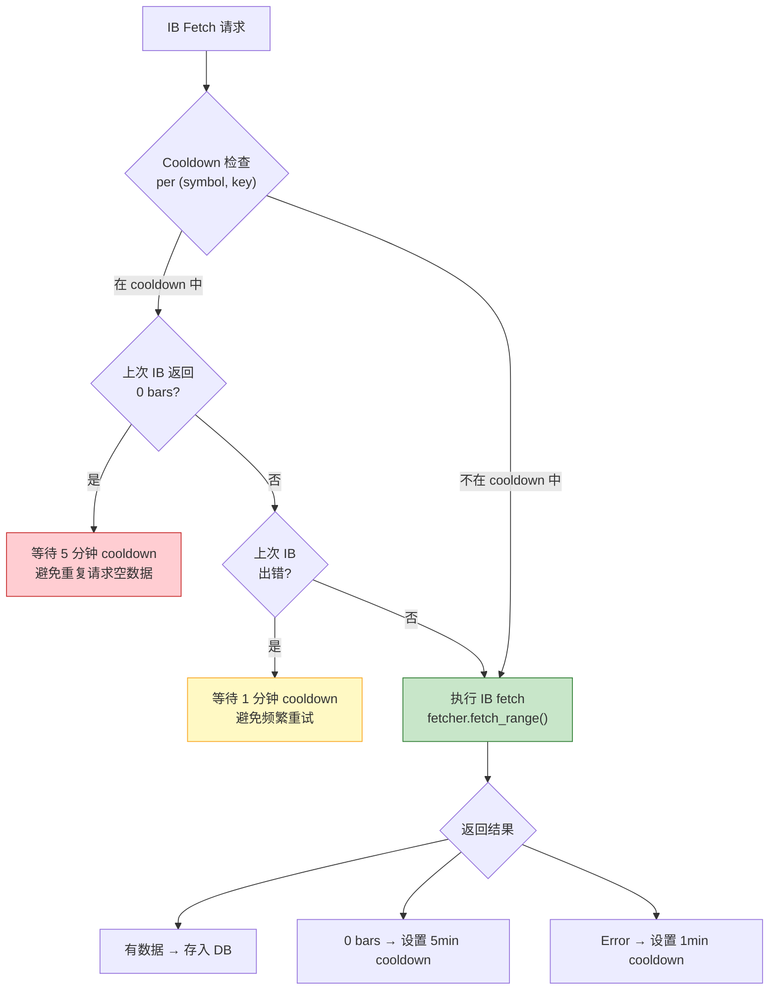

### IB Fetch 决策流程

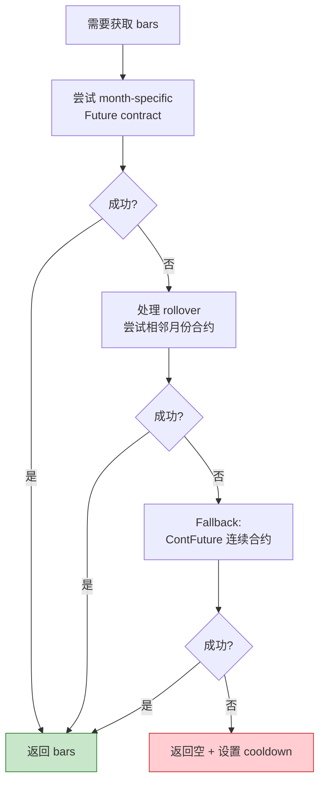

---

## 5. 实时数据流 (Real-time Data Flow)

实时数据从 IB TWS 的 market data subscription 开始，经过 tick aggregation 组装成 5min bar，最终通过 WebSocket 推送到前端。

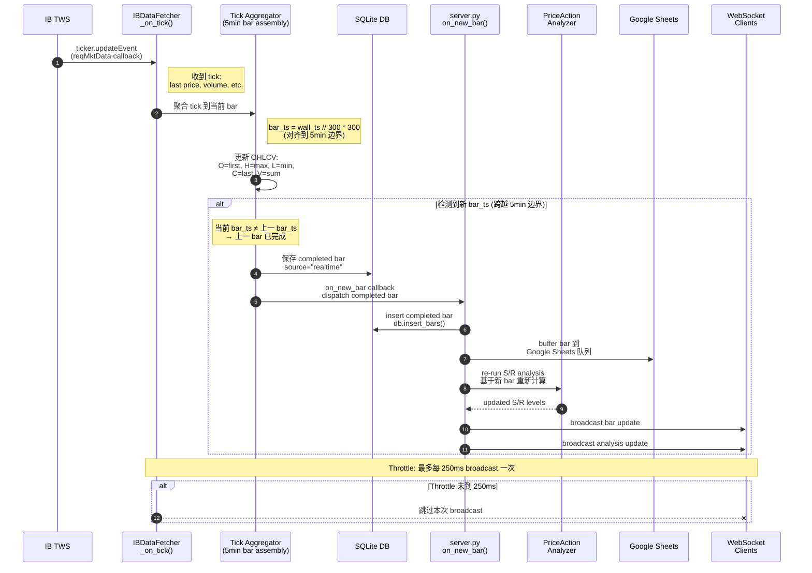

### Tick → Bar 聚合细节

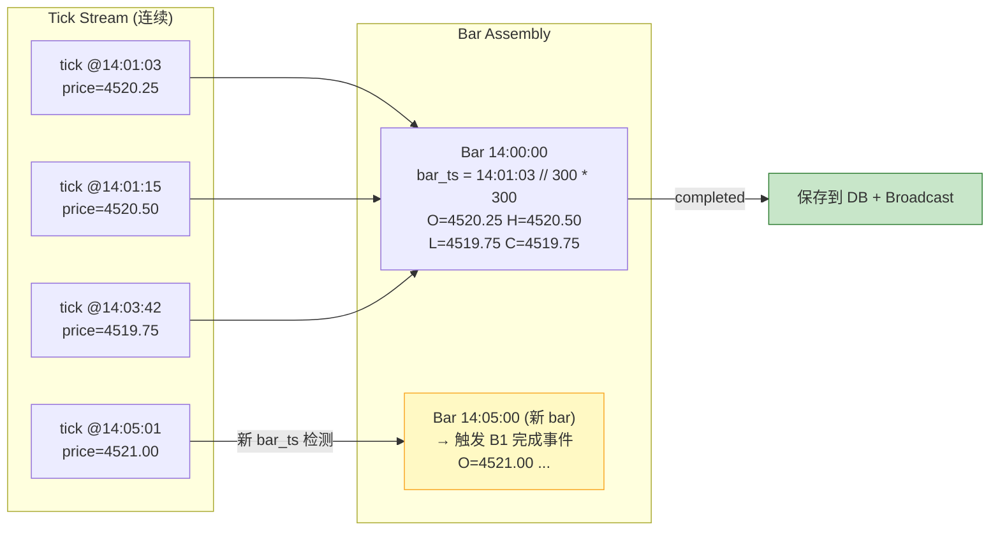

---

## 6. DB 与 IB 数据协作 (DB + IB Collaboration)

DB 作为持久化层，IB 作为数据源。两者协作模式如下：

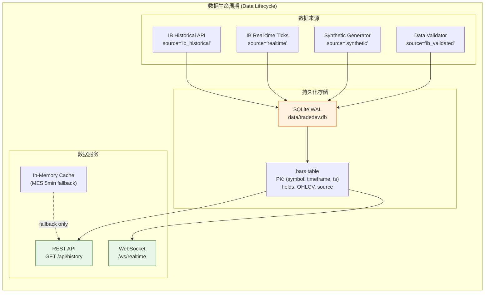

### 请求处理中 DB 与 IB 的协作序列

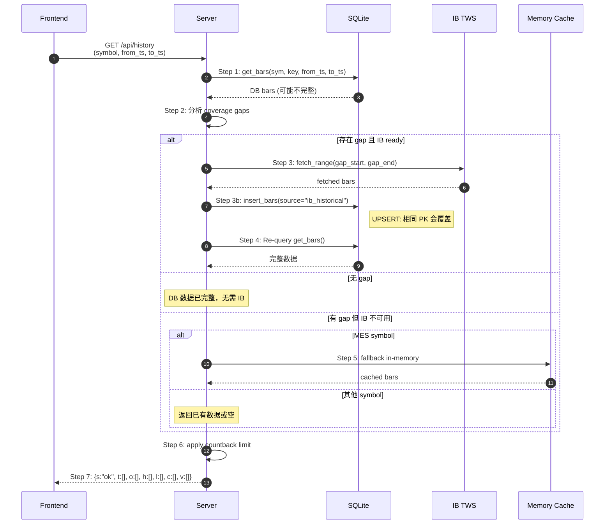

### DB Source 标签说明

| Source Tag | 产生方式 | 优先级 | 说明 |
|-----------|---------|--------|------|
| `ib_historical` | IB reqHistoricalData | 高 | 标准历史数据 |
| `realtime` | Tick aggregation | 高 | 实时组装的 bar |
| `ib_validated` | Data validator fix | 最高 | 校验后修正的数据 |
| `synthetic` | GBM model | 低 | 测试用合成数据 |
| `unknown` | Legacy import | 低 | 历史遗留数据 |

> **注意**: 所有 source 的 bars 共享同一张表，PRIMARY KEY `(symbol, timeframe, ts)` 保证同一时间点只有一条记录。后写入的数据会覆盖先前的数据（UPSERT 语义）。

---

## 7. 数据校验流程 (Data Validation)

数据校验确保 DB 中存储的 bars 与 IB 提供的历史数据一致。

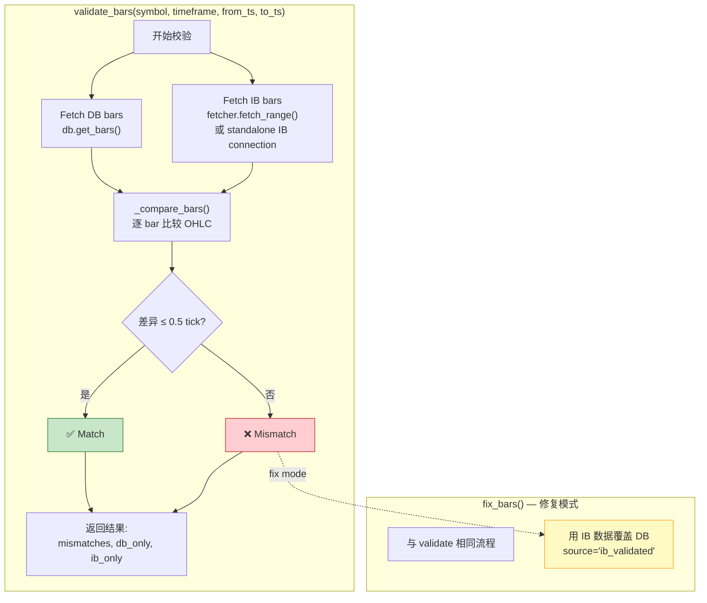

### validate_all() 全量校验流程

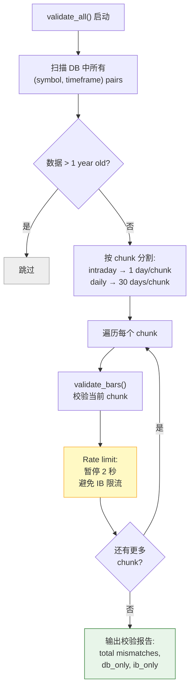

### 校验容差规则

```
OHLC 比较: |db_value - ib_value| ≤ 0.5 * tick_size
  - MES tick_size = 0.25 → tolerance = 0.125
  - 超过 tolerance 视为 mismatch

Volume: 不参与比较 (IB historical volume 可能与 realtime 不同)

Timestamp: 精确匹配 (unix epoch seconds)
  - db_only: DB 有但 IB 没有 → 可能是非交易时段的 bar
  - ib_only: IB 有但 DB 没有 → 数据缺失，需要补录
```

---

## 8. 前端数据获取 (Frontend Data Flow)

### 前端初始化 → 历史数据加载 → 实时更新全流程

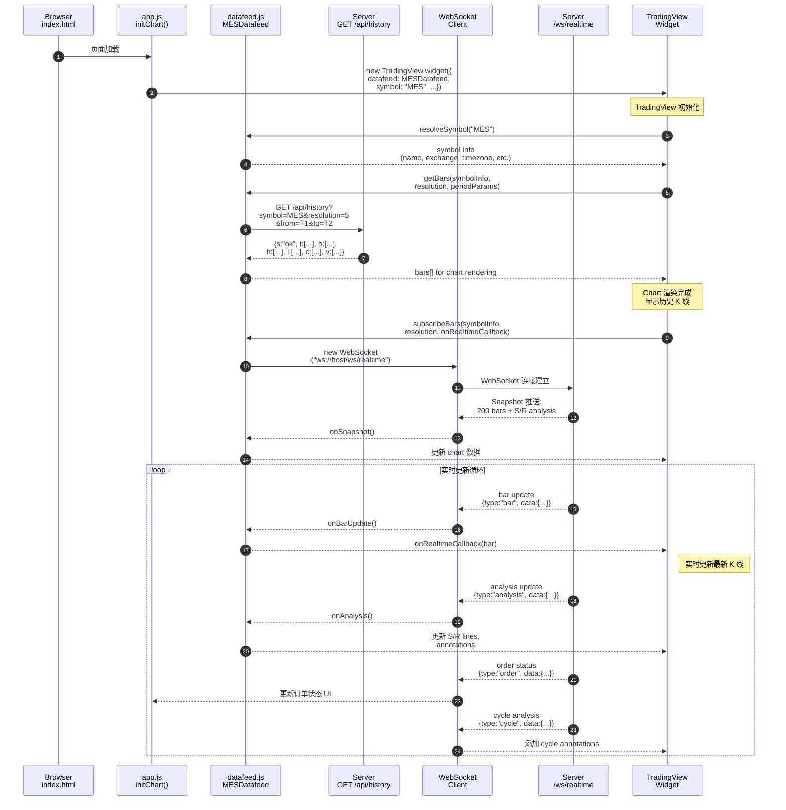

### Chart 滚动触发历史数据加载

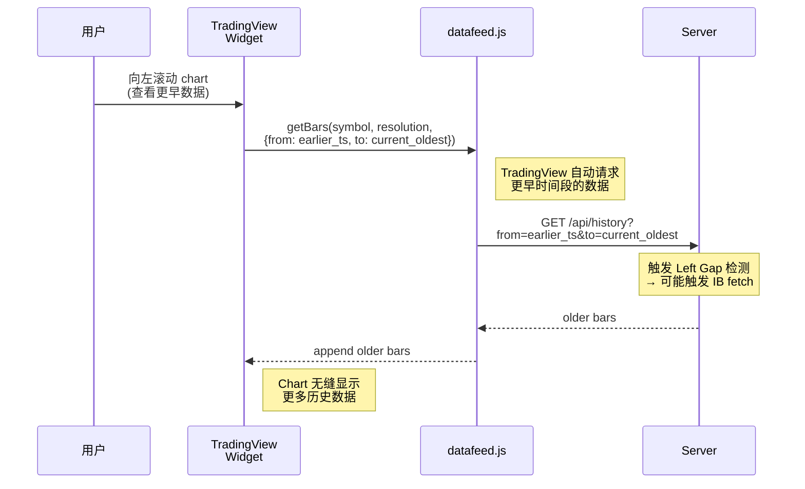

### WebSocket 消息类型汇总

| 消息类型 | 方向 | 格式 | 说明 |
|---------|------|------|------|
| `snapshot` | Server → Client | `{type:"snapshot", bars:[...], analysis:{...}}` | 连接时推送 200 bars + 分析 |
| `bar` | Server → Client | `{type:"bar", data:{t,o,h,l,c,v}}` | 实时 bar 更新 (≤250ms throttle) |
| `analysis` | Server → Client | `{type:"analysis", data:{sr_levels, ...}}` | S/R 分析更新 |
| `order` | Server → Client | `{type:"order", data:{status, ...}}` | 订单状态变更 |
| `cycle` | Server → Client | `{type:"cycle", data:{annotations, ...}}` | Market cycle 分析标注 |

---

## 附录: 数据库 Schema

```sql
-- SQLite WAL mode
PRAGMA journal_mode=WAL;

CREATE TABLE IF NOT EXISTS bars (
    symbol    TEXT    NOT NULL,
    timeframe TEXT    NOT NULL,
    ts        INTEGER NOT NULL,  -- Unix epoch seconds
    open      REAL    NOT NULL,
    high      REAL    NOT NULL,
    low       REAL    NOT NULL,
    close     REAL    NOT NULL,
    volume    INTEGER DEFAULT 0,
    source    TEXT    DEFAULT 'unknown',
    PRIMARY KEY (symbol, timeframe, ts)
);

-- Source values:
--   'ib_historical'  — fetched via IB reqHistoricalData
--   'realtime'       — assembled from live market ticks
--   'synthetic'      — generated test data (GBM model)
--   'ib_validated'   — corrected by data_validator.py
--   'unknown'        — legacy/imported data
```
